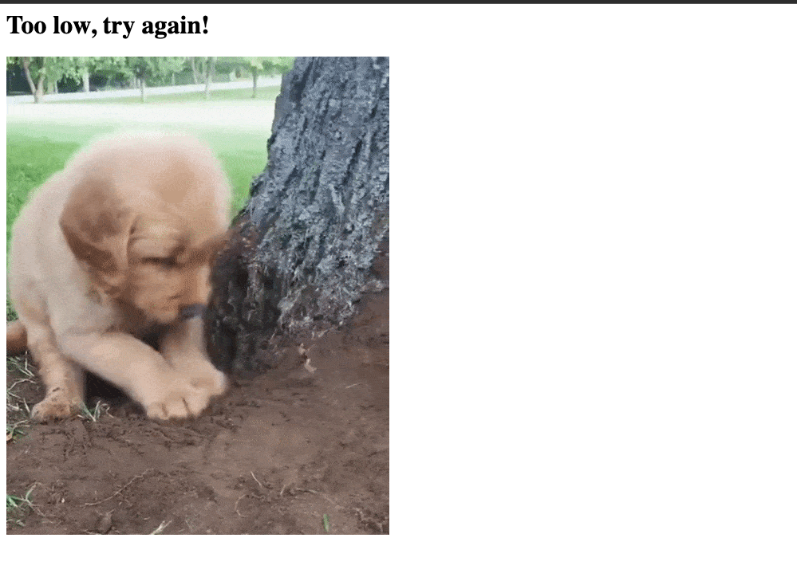
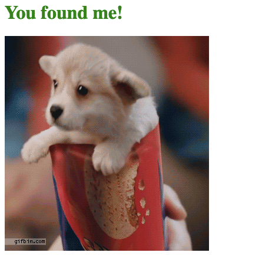

# higher-lower

Simple Number guessing Game made using Flask

## Table of contents
- [Overview](#overview)
  - [Screenshot](#screenshot)
  - [Links](#links)
- [My process](#my-process)
  - [Built with](#built-with)
  - [What I learned](#what-i-learned)
  - [Useful resources](#useful-resources)
- [Author](#author)
- [Acknowledgments](#acknowledgments)

## Overview

### Screenshot

### Links
- Github Repository: [Yash Viradia](http://yashviradia.tech/)

## My process

### Built with

- Python using Flask Framework

### What I learned
- Python Decorators

### Useful resources
- [Stack Overflow](https://stackoverflow.com/)
- [Google](https://www.google.com/)

## Author
- Website - [Yash Viradia](http://yashviradia.tech/)
- Twitter - [@theyashviradia](https://twitter.com/theyashviradia)

## Acknowledgments
- LondonAppBrewery - [LondonAppBrewery](https://www.londonappbrewery.com/)

